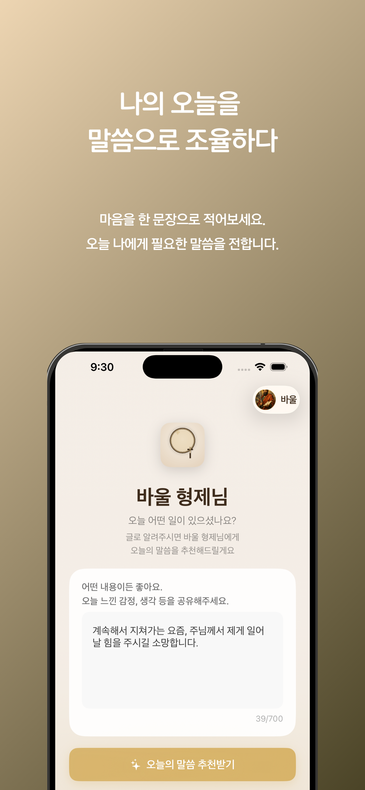
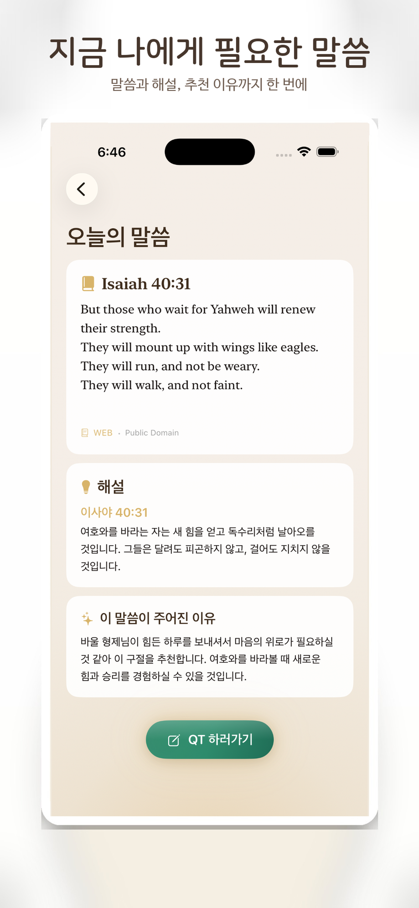
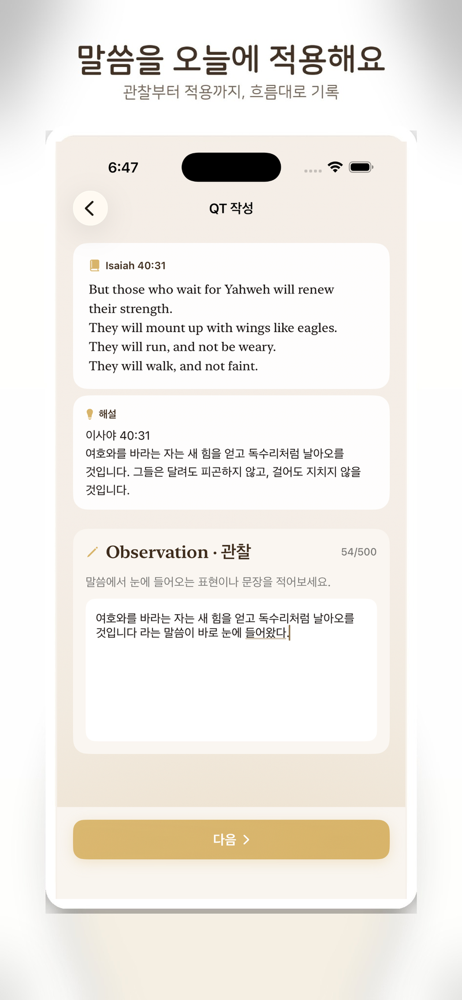
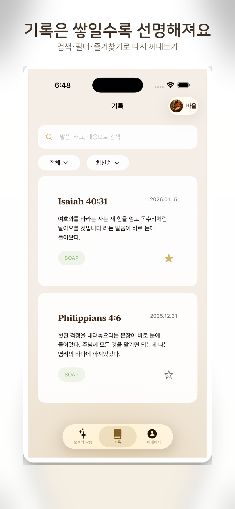
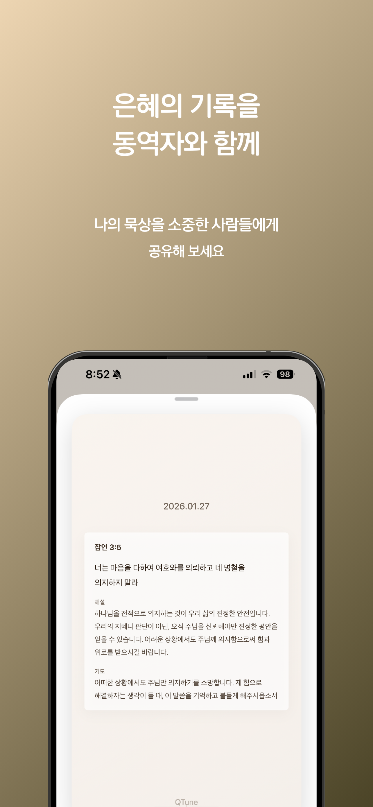

# QTune (큐튠)

**QT(Quiet Time) + Tune**
말씀 앞에서 내 마음을 조율하는 묵상 앱

---

## 📱 App Store

👉 [App Store에서 다운로드](https://apps.apple.com/kr/app/%ED%81%90%ED%8A%A0-qtune/id6757230938)

---

## 🌿 QTune은 이런 앱이에요

QTune(큐튠)은
QT(Quiet Time) + Tune의 합성어로,
말씀 앞에서 내 마음을 조율하는 묵상 앱입니다.

하루가 무겁게 느껴지는 날도,
마음이 흔들리는 날도 있죠.

QTune은
오늘의 감정과 상황을 한 문장으로 적는 것에서 시작해,
AI가 그 흐름에 맞는 말씀을 추천해 줍니다.

그리고
말씀을 읽고 → 이해하고 → 오늘에 적용하는 과정을
자연스럽게 기록으로 이어갈 수 있도록 돕습니다.

오늘의 마음을 있는 그대로 적고
추천받은 말씀을 따라
하루를 다시 조율해 보세요.

  
  
  

  
  
  

---

## ✨ 주요 기능

### 🤖 AI 말씀 추천
- 오늘의 **감정 / 상황**을 한 문장으로 입력
- AI가 맥락에 맞는 **성경 말씀 + 해설 + 추천 이유** 제공

### 📝 두 가지 묵상 방식
- **SOAP**: 말씀을 차분히 이해하고 삶에 연결
- **ACTS**: 마음을 돌아보며 기도로 이어지는 묵상
- 상황과 컨디션에 맞게 언제든 선택 가능

### 📚 기록 관리
- 말씀 / 내용 / 태그 기반 **검색**
- 필터 & 정렬
- **즐겨찾기**로 다시 꺼내보기

---

## 🙋 이런 분께 잘 맞아요

- QT를 꾸준히 하고 싶은데 매번 **시작이 어려운 분**
- 마음이 복잡할 때 **말씀으로 중심**을 잡고 싶은 분
- 짧게라도 **기록하며 신앙과 일상**을 연결하고 싶은 분

---

## 🏗 Architecture

QTune은
**Clean Architecture** 기반의 선언형 **MVI 구조**로 설계되었습니다.

### 핵심 구조

  

### 설계 포인트

- **Domain이 중심**
  - Presentation -> Domain
  - Data → Domain
  - 의존성 역전 원칙(DIP) 철저히 준수

- **UI는 상태(State)에만 반응**
  - Side Effect는 Intent → UseCase로만 흐름 제어

---

## 🧠 Tech Stack

### iOS
- Swift / SwiftUI
- MVI (Intent / State / Reducer)
- Combine
- Swift Concurrency

### Architecture
- Clean Architecture
- Unidirectional Data Flow
- Dependency Injection

### Backend
- Firebase (Authentication, Firestore, Functions)
- OpenAI GPT-4o-mini

### AI
- 감정 기반 텍스트 분석
- 상황 맥락 기반 말씀 추천

---

## 🧑‍💻 Author

**LEE SEUNGJU (이승주)**

- GitHub: [https://github.com/inju2403](https://github.com/inju2403)
- Blog: [https://blog.naver.com/inju2403](https://blog.naver.com/inju2403)

---

## 🔒 Privacy Policy

QTune은 사용자의 개인정보를 중요하게 생각합니다.

자세한 개인정보 처리방침은 [여기](./privacy-policy.md)에서 확인하실 수 있습니다.

---

## 📄 License

MIT License

Copyright (c) 2026 LEE SEUNGJU

Permission is hereby granted, free of charge, to any person obtaining a copy
of this software and associated documentation files (the "Software"), to deal
in the Software without restriction, including without limitation the rights
to use, copy, modify, merge, publish, distribute, sublicense, and/or sell
copies of the Software, and to permit persons to whom the Software is
furnished to do so, subject to the following conditions:

The above copyright notice and this permission notice shall be included in all
copies or substantial portions of the Software.

THE SOFTWARE IS PROVIDED "AS IS", WITHOUT WARRANTY OF ANY KIND, EXPRESS OR
IMPLIED, INCLUDING BUT NOT LIMITED TO THE WARRANTIES OF MERCHANTABILITY,
FITNESS FOR A PARTICULAR PURPOSE AND NONINFRINGEMENT. IN NO EVENT SHALL THE
AUTHORS OR COPYRIGHT HOLDERS BE LIABLE FOR ANY CLAIM, DAMAGES OR OTHER
LIABILITY, WHETHER IN AN ACTION OF CONTRACT, TORT OR OTHERWISE, ARISING FROM,
OUT OF OR IN CONNECTION WITH THE SOFTWARE OR THE USE OR OTHER DEALINGS IN THE
SOFTWARE.
